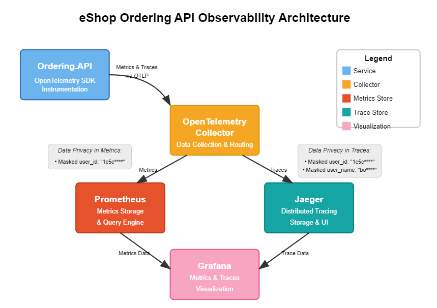
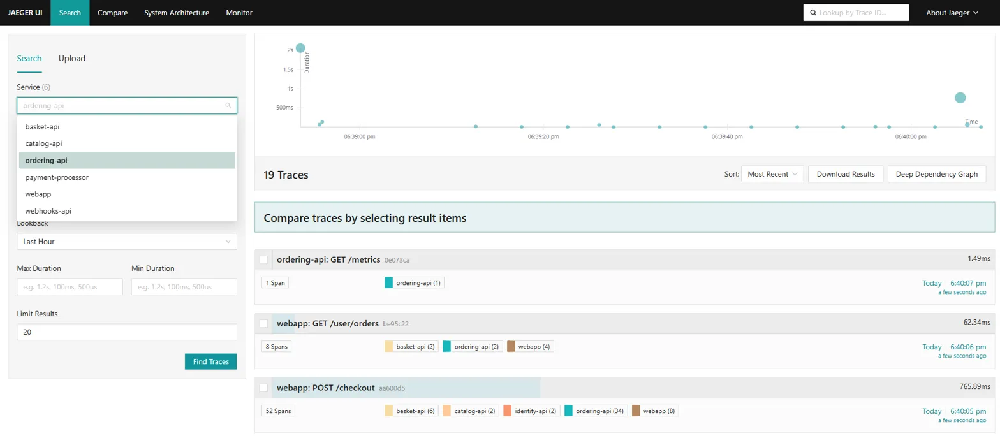
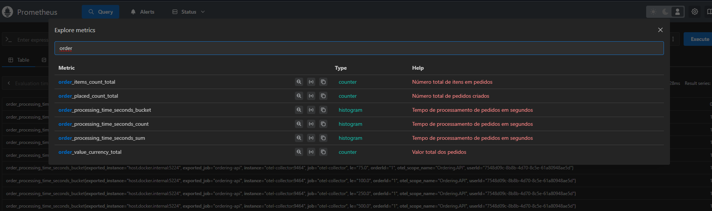
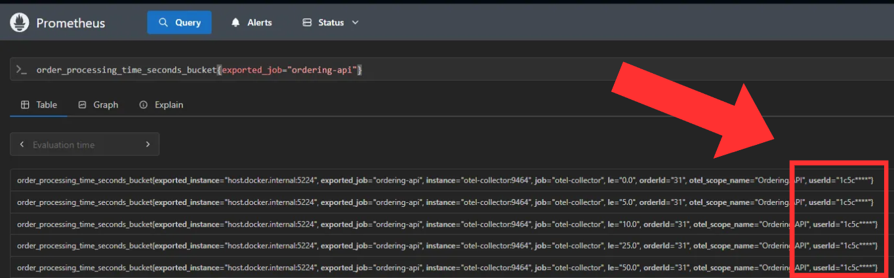
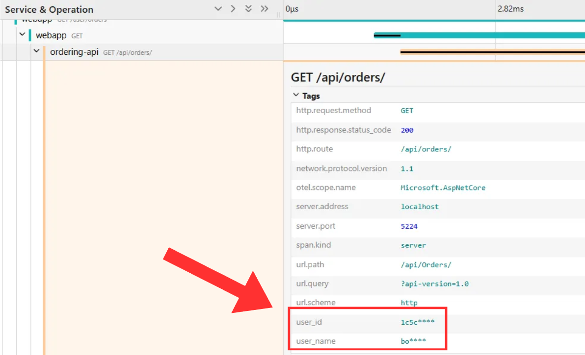
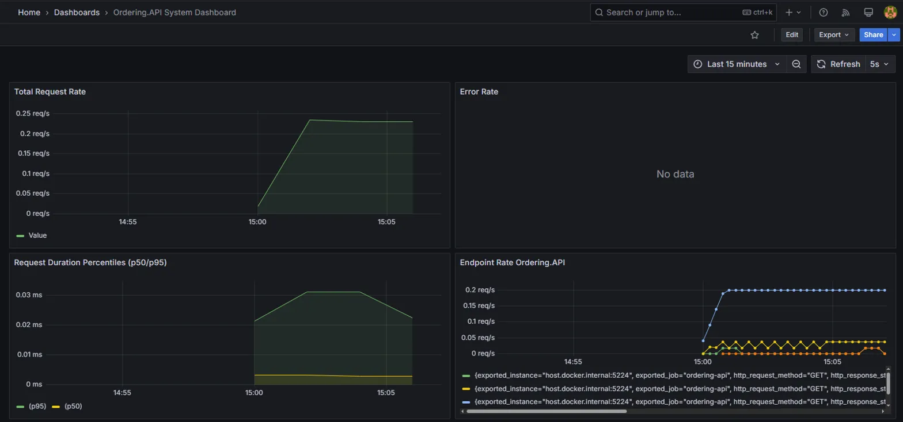
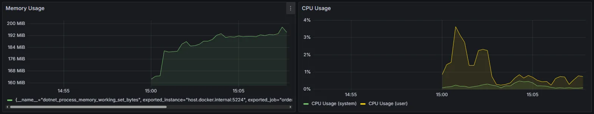
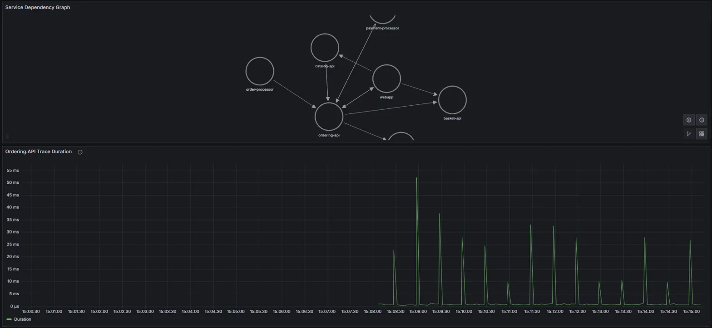
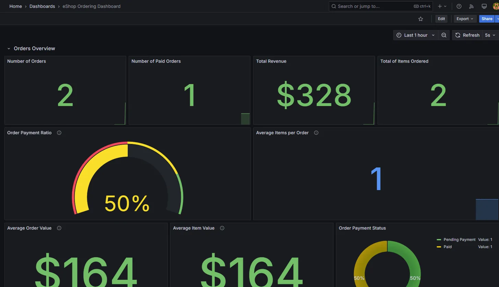

# Integration of OpenTelemetry & Security in eShop - Implementation Report

## Project Overview

This report details the implementation of OpenTelemetry tracing and security features in the eShop microservices architecture, focusing specifically on the "Place an Order" feature within the Ordering API microservice. The implementation follows the guidelines provided in Assignment 02.02, which emphasized adding observability capabilities while ensuring sensitive data handling compliance.

## Observability Architecture



The diagram above illustrates the observability infrastructure implemented for the eShop Ordering API:

1. **Ordering.API** is instrumented with OpenTelemetry SDK to collect metrics and traces
2. **OpenTelemetry Collector** serves as the central routing component for telemetry data
3. **Data Privacy** is maintained in both metrics and traces by masking sensitive information
4. **Prometheus** stores metrics data from the Ordering API
5. **Jaeger** provides distributed tracing storage and querying capabilities
6. **Grafana** visualizes both metrics and traces in unified dashboards

## 1. Feature Selection & Scope

### Selected Feature: Place an Order Flow

The "Place an Order" flow was selected for end-to-end tracing, which involves the complete lifecycle of an order from creation through processing, encompassing:

- Order creation via `CreateOrderAsync` API endpoint
- Order processing through various commands/handlers
- Event-driven communication with other microservices
- Order status transitions (submitted → paid → shipped)

## 2. OpenTelemetry Implementation

### 2.1 Instrumentation Setup

OpenTelemetry was integrated at two levels:

1. **Global Service Level Configuration**:
    - Configured at the AppHost level to apply tracing to all microservices
    - Implemented in `ObservabilityExtensions.cs` to standardize observability setup

```csharp
// from ObservabilityExtensions.cs
public static IResourceBuilder<T> WithObservability<T>(
    this IResourceBuilder<T> builder, 
    string serviceName, 
    IResourceBuilder<ContainerResource> jaeger) 
{
    var otelEndpoint = "http://localhost:4319";
    
    return builder
        .WithEnvironment("ConnectionStrings__Jaeger", otelEndpoint)
        .WithEnvironment("OTEL_SERVICE_NAME", serviceName)
        .WithEnvironment("OTEL_RESOURCE_ATTRIBUTES", $"service.name={serviceName}")
        .WithEnvironment("OTEL_EXPORTER_OTLP_ENDPOINT", otelEndpoint)
        .WithEnvironment("OTEL_EXPORTER_OTLP_PROTOCOL", "grpc")
        .WithEnvironment("OTEL_METRICS_EXPORTER", "otlp,prometheus")
        .WithEnvironment("OTEL_LOGS_EXPORTER", "otlp")
        .WithEnvironment("OTEL_TRACES_EXPORTER", "otlp")
        .WithEnvironment("OTEL_TRACES_SAMPLER", "always_on")
        .WithEnvironment("OTEL_PROPAGATORS", "tracecontext,baggage");
}
```

In the image below, we can see the Jaeger UI with all services:



2. **Ordering API-Specific Instrumentation**:
    - Added OpenTelemetry SDK packages in `Ordering.API.csproj`
    - Configured custom metrics collection for the ordering process:
      - **order_placed_count:** Counts the total number of orders created
      - **order_paid_count:** Tracks the number of orders that have been paid
      - **order_items_count:** Measures the total number of items across all orders
      - **order_value_total:** Tracks the monetary value of orders (in currency units)
      - **order_processing_time_seconds:** Histogram tracking order processing duration
      - **order_payment_processing_time_seconds:** Histogram tracking payment processing duration
      - **order_processing_errors:** Counts errors encountered during order processing
      - **payment_processing_errors:** Tracks errors during payment processing

```csharp
// from Program.cs
// Creating meter
var meter = new Meter("Ordering.API");
builder.Services.AddSingleton(meter);

// Register metrics with specific keys
builder.Services.AddKeyedSingleton<Counter<long>>("orderPlacedCounter",
    meter.CreateCounter<long>("order_placed_count", description: "Número total de pedidos criados"));

builder.Services.AddKeyedSingleton<Counter<long>>("orderPaidCounter",
    meter.CreateCounter<long>("order_paid_count", description: "Número total de pedidos pagos"));

// [...additional metrics registration...]

// Configure metrics
builder.Services.AddOpenTelemetry()
    .WithMetrics(metrics =>
    {
        metrics
            .AddAspNetCoreInstrumentation()
            .AddHttpClientInstrumentation()
            .AddMeter("Ordering.API")
            .AddOtlpExporter(options =>
            {
                options.Endpoint = new Uri("http://localhost:4317");
            });
    });
```

Some of the implemented metrics in Prometheus:



### 2.2 Command Instrumentation

Custom metrics were integrated into key command handlers to track order flow:

```csharp
// from CreateOrderCommandHandler.cs
public async Task<bool> Handle(CreateOrderCommand message, CancellationToken cancellationToken)
{
    var stopwatch = System.Diagnostics.Stopwatch.StartNew();

    try
    {
        // [...order creation logic...]

        // Metrics
        _logger.LogInformation("Incrementing Order Placed Counter");
        _orderPlacedCounter.Add(1, new KeyValuePair<string, object>("userId", message.UserId));

        // Item counter
        _orderItemsCounter.Add(totalItems, new KeyValuePair<string, object>("orderId", order.Id.ToString()));

        // Order total value
        _orderValueCounter.Add((long)orderTotal, new KeyValuePair<string, object>("orderId", order.Id.ToString()));

        // [...more order processing...]

        stopwatch.Stop();
        // Record processing time in seconds
        _orderProcessingTimeHistogram.Record(stopwatch.Elapsed.TotalSeconds,
            new KeyValuePair<string, object>("orderId", order.Id.ToString()),
            new KeyValuePair<string, object>("userId", message.UserId));
        
        return result;
    }
    catch (Exception ex)
    {
        stopwatch.Stop();
        _orderProcessingErrorsCounter.Add(1, new KeyValuePair<string, object>("errorType", ex.GetType().Name));
        _logger.LogError(ex, "Error processing order");
        throw;
    }
}
```

Similar instrumentation was added to the `SetPaidOrderStatusCommandHandler` to track payment processing metrics.

## 3. Data Privacy & Security

### 3.1 User Data Masking

Implemented a dedicated masking utility for sensitive user data:

```csharp
// from UserDataMasker.cs
public static class UserDataMasker
{
    /// <summary>
    /// Masks a user ID by showing only the first 4 characters followed by asterisks
    /// </summary>
    public static string MaskUserId(string userId)
    {
        if (string.IsNullOrEmpty(userId))
            return userId;
            
        if (userId.Length > 4)
            return userId.Substring(0, 4) + "****";
        else
            return userId + "****";
    }
    
    /// <summary>
    /// Masks a username by showing only the first 2 characters followed by asterisks
    /// </summary>
    public static string MaskUserName(string userName)
    {
        if (string.IsNullOrEmpty(userName))
            return userName;
            
        if (userName.Length > 2)
            return userName.Substring(0, 2) + "****";
        else
            return userName + "****";
    }
}
```

This mask can be visualized in Prometheus queries, like the following:



### 3.2 Middleware for Automatic Trace Sanitization

Created a middleware to ensure user data in traces is automatically masked:

```csharp
// from UserTrackingMiddleware.cs
public class UserTrackingMiddleware
{
    private readonly RequestDelegate _next;

    public UserTrackingMiddleware(RequestDelegate next)
    {
        _next = next;
    }

    public async Task InvokeAsync(HttpContext context)
    {
        var activity = Activity.Current;
        if (activity != null && context.User.Identity?.IsAuthenticated == true)
        {
            // Get user identifiers from claims
            var userId = context.User.FindFirst("sub")?.Value;
            var userName = context.User.Identity.Name;

            // Mask user information for privacy
            if (!string.IsNullOrEmpty(userId))
            {
                activity.SetTag("user_id", UserDataMasker.MaskUserId(userId));
            }

            if (!string.IsNullOrEmpty(userName))
            {
                activity.SetTag("user_name", UserDataMasker.MaskUserName(userName));
            }
        }

        await _next(context);
    }
}
```

This middleware was registered in the application pipeline:

```csharp
// from Program.cs
// Add user tracking middleware after authentication
app.UseAuthentication();
app.UseAuthorization();
app.UseUserTracking(); // Custom middleware to mask sensitive data
```

We can see the results in the following image:



## 4. Observability Infrastructure

### 4.1 Container Setup

The observability stack was built using four main components:

```csharp
// from ObservabilityExtensions.cs
public static (IResourceBuilder<ContainerResource>, IResourceBuilder<ContainerResource>, IResourceBuilder<ContainerResource>) AddObservability(this IDistributedApplicationBuilder builder)
{
    // Add Prometheus
    var prometheus = builder.AddContainer("prometheus", "prom/prometheus:latest");
    prometheus.WithBindMount("../../prometheus.yml", "/etc/prometheus/prometheus.yml");
    prometheus.WithEndpoint(9090, 9090, name: "prometheus-ui", isExternal: true);
    
    // Add Grafana
    var grafana = builder.AddContainer("grafana", "grafana/grafana:latest");
    grafana.WithVolume("grafana-storage", "/var/lib/grafana");
    grafana.WithBindMount("./grafana/provisioning", "/etc/grafana/provisioning");
    grafana.WithBindMount("./grafana/dashboards", "/var/lib/grafana/dashboards");
    grafana.WithEndpoint(3000, 3000, name: "grafana-ui", isExternal: true);
    
    // Add Jaeger
    var jaeger = builder.AddContainer("jaeger", "jaegertracing/jaeger", "2.3.0")
        .WithEndpoint(port: 16686, targetPort: 16686, name: "jaeger-ui")
        .WithEndpoint(port: 4319, targetPort: 4319, name: "jaeger-otlp-grpc")
        // [...other configuration...]
        .WithBindMount(jaegerPath, "/etc/jaeger/config.yml")
        .WithArgs("--config", "/etc/jaeger/config.yml");
    
    // Add OpenTelemetry Collector
    var otelCollector = builder.AddContainer("otel-collector", "otel/opentelemetry-collector-contrib:latest");
    otelCollector.WithBindMount("../../otel-collector-config.yml", "/etc/otel-collector-config.yml");
    otelCollector.WithEndpoint(4317, 14317, name: "otlp-grpc");
    // [...other configuration...]
    
    return (prometheus, grafana, jaeger);
}
```

### 4.2 Telemetry Flow Configuration

Data collection and routing was configured through:

1. **otel-collector-config.yml**: Defined collectors and exporters for metrics and traces
    - Configured receivers for OTLP and Prometheus data
    - Established pipeline for metrics and traces from microservices to storage backends
   
2. **prometheus.yml:** Configured Prometheus metrics collection 
    - Defined scrape configuration to collect metrics from the OpenTelemetry Collector
    - This enables metrics from all instrumented services to be collected via a single endpoint

3. **jaeger.yml**: Configured Jaeger as the tracing backend
    - Set up storage and metrics backends
    - Defined receivers and exporters for trace data

## 5. Grafana Dashboards

Two comprehensive dashboards were created for visualizing the observability data:

### 5.1 Ordering API System Dashboard

The system dashboard (ordering-api-system.json) provides technical metrics for the Ordering API service:

- **Request rates and endpoints performance metrics**
- **CPU and memory usage**
- **Request duration percentiles**
- **Error rates**

From Jaeger:
- **Service dependency visualization**
- **Trace duration visualization**





### 5.2 eShop Ordering Business Dashboard

The business dashboard (ordering-dashboard.json) focuses on order-related business metrics:

From Prometheus:
- **Total orders and paid orders counts**
- **Revenue metrics**
- **Order payment ratio**
- **Average items per order**
- **Average order value**
- **Order payment status distribution**



These dashboards provide both technical and business stakeholders with valuable insights into system performance and business activity.

## Conclusion

The implementation successfully meets the objectives specified in the assignment:

1. **Implement OpenTelemetry tracing on a single feature end-to-end**: Successfully implemented tracing for the "Place an Order" flow, capturing the complete order lifecycle.

2. **Mask or exclude sensitive data from telemetry and logs**: Implemented comprehensive data privacy features for user IDs, usernames, and payment information through custom masking utilities and middleware.

3. **Set up Grafana dashboards to visualize traces and metrics**: Created two specialized dashboards - a system dashboard for technical metrics and a business dashboard for business insights.

4. **Observability infrastructure**: Established a complete observability stack with OpenTelemetry Collector, Prometheus, Jaeger, and Grafana, enabling unified monitoring and analysis.

The solution provides a comprehensive observability strategy that balances technical monitoring needs with data privacy requirements, enabling effective system monitoring without compromising sensitive information.

## Use of Generative AI Tools

I used Claude to help with configuring the observability tools and writing this report. It was particularly useful for setting up the connections between OpenTelemetry, Jaeger and Prometheus, as well as organizing my implementation details into this structured format. 

## Link to the Repository

https://github.com/JakeRosa/AS-Assign02_02

### How to Run:

#### Prerequisites

- .NET 9 SDK
- Docker/ Docker Desktop

#### Execute the following command:

```
dotnet run --project src/eShop.AppHost/eShop.AppHost.csproj
```

This command will create all necessary docker containers.